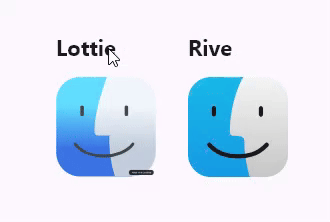

# Flutter Animation Training

## Overview
A Flutter app to practice using custom animations.

### Key features
- Lottie animation player.
- Rive animation player.

### Screenshots

### Download
You can download and use it [here](https://rive.app/community/files/15527-29284-apple-finder-reactive-icon)!

## Language & Tools used
- 
- LottieLab
- Rive

## Usage
1. install flutter engine -> https://docs.flutter.dev/get-started/install
2. tap command `flutter run` in the root folder of the project

## Author
@Fenysk